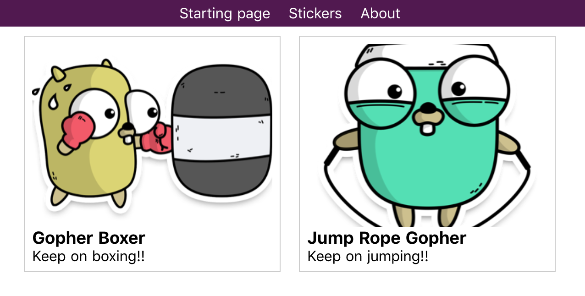
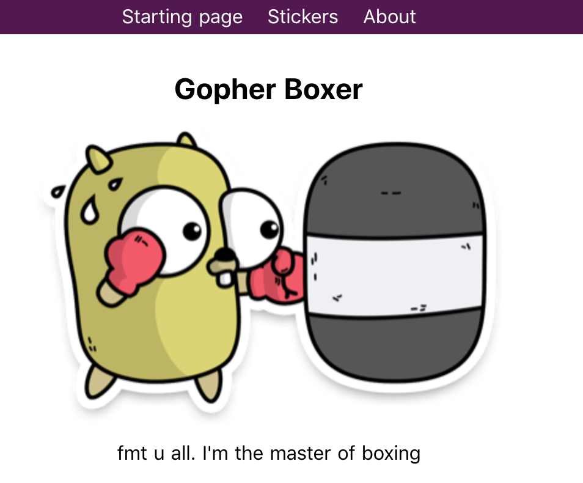

# my-awesome-nuxt-app

> My splendiferous Nuxt.js project

I built this app by watching Maximilian Schwarzmüllers video [Nuxt.js - Introduction by Project](https://www.youtube.com/watch?v=nteDXuqBfn0)

It lists Gopher Stickers from [https://gopherswag.com/](https://gopherswag.com/) ... not really. I'm just faking a request but the images are from that site.





## Build Setup

``` bash
# install dependencies
$ yarn install

# serve with hot reload at localhost:3000
$ yarn run dev

# build for production and launch server
$ yarn run build
$ yarn start

# generate static project
$ yarn run generate
```

For detailed explanation on how things work, checkout [Nuxt.js docs](https://nuxtjs.org).
